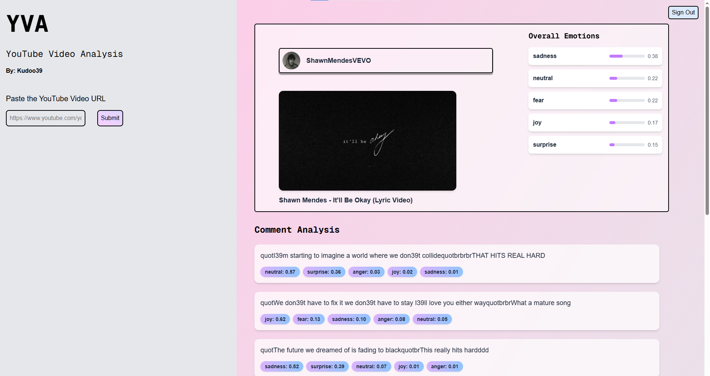

# 🎥 YouTube Video Analysis (YVA)

A full-stack web application to analyze YouTube video comments using **FastAPI**, **Next.js**, and **Hugging Face**.  
It fetches comments via the **YouTube Data API**, processes them with a **Hugging Face emotion classification model**, and visualizes the results with a modern UI.



## 🚀 Features

- 🔗 Paste a YouTube video URL and fetch its top comments.
- 🤖 Analyze emotions in comments using **Hugging Face Inference API**.
- 📊 Display **overall emotion ranking** across all comments.
- 💬 Show **per-comment emotion breakdown** with clean UI badges.
- 🎨 Modern frontend built with **Next.js 14 + TailwindCSS**.
- ⚡ Backend API built with **FastAPI**, async-first and production-ready.
- 🔒 Secure API keys with environment variables.

---

## 🛠️ Tech Stack

### Frontend

- Next.js 14
- TailwindCSS

### Backend

- FastAPI
- Uvicorn
- Transformers / Hugging Face Hub

### APIs

- YouTube Data API v3
- Hugging Face Inference API

## 📂 Project Structure

```
app
 ┣ api
 ┃ ┗ auth
 ┃ ┃ ┗ [...nextauth]
 ┃ ┃ ┃ ┗ route.js
 ┣ components
 ┃ ┣ AppBar.jsx
 ┃ ┣ ChannelHeader.jsx
 ┃ ┣ Comments.jsx
 ┃ ┣ Providers.jsx
 ┃ ┣ Result.jsx
 ┃ ┣ SignIn.jsx
 ┃ ┗ VideoHeader.jsx
 ┣ fastapi
 ┃ ┣ __pycache__
 ┃ ┃ ┗ index.cpython-312.pyc
 ┃ ┣ .env
 ┃ ┣ .env.example
 ┃ ┗ index.py
 ┣ action.js
 ┣ favicon.ico
 ┣ globals.css
 ┣ layout.js
 ┗ page.js
```
